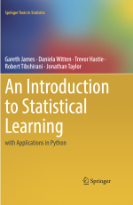
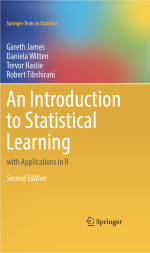

# Daftar ebook yang dapat digunakan sebagai bahan belajar temen-temen

| Sampul | Judul |
| ----- | ------ |
|  | [A Hands-On Introduction to Data Science by Chirag Shah](https://drive.google.com/file/d/1HdMrkvyaj10OqpV7p3VU7QbfSVeLw5of/view?usp=sharing) | 
|  | [An Introduction to Statistical Learning with Python (ISLP)](https://drive.google.com/file/d/1WXN2aSShIwmztHMfvwwOMXKdpexDFcG_/view?usp=sharing) | 
|  | [An Introduction to Statistical Learning with R (ISLR)](https://drive.google.com/file/d/1zX2BPmsW8T_9XiQDChF-_6abZwBld0HT/view?usp=sharing) | 
